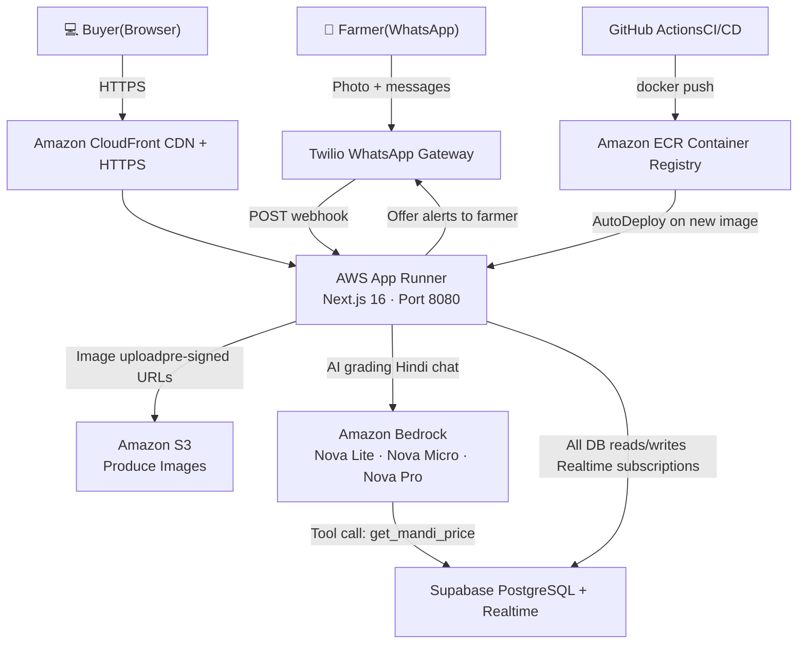

# 🌾 FarmFast — AI-Powered Agricultural Marketplace

> Connecting Indian farmers directly with buyers through WhatsApp + AI quality grading, powered entirely by Amazon Web Services. No middlemen. No app required for farmers.


---

## The Problem

India's agricultural supply chain is dominated by intermediaries (commission agents / *arhatiyas*) who take 20–30% margins on every transaction between farmer and buyer. Farmers in rural areas lack smartphones or data plans, making app-based solutions impractical. Buyers lack transparency into produce quality before committing to purchase.

**FarmFast solves this with two interfaces:**

- **Farmers** use WhatsApp — which already runs on feature phones with basic data — to photograph, list, and sell produce without leaving their field.
- **Buyers** use a web dashboard with AI-graded listings, maps, live market prices, and one-click offer submission.

---

## Features

### For Farmers — WhatsApp Only, No App Required

| Feature | How It Works |
|---------|-------------|
| **One-photo listing** | Farmer sends a WhatsApp photo → Amazon Nova Lite grades quality (A/B/C) in ~10 seconds |
| **AI quality grading** | Computer vision grades produce: colour, surface condition, uniformity. Returns grade, shelf life, and ₹/kg price range |
| **Live mandi pricing** | Bedrock's agentic tool loop fetches today's wholesale mandi price from the database during grading |
| **Reserve price protection** | System auto-sets a floor price: `MAX(mandi_price, ai_min_price × 0.85)` — farmers can never sell below market |
| **Hindi-first experience** | All bot responses in Hindi. AI grading returns a one-sentence Hindi summary |
| **Location from pincode** | Farmer sends a 6-digit pincode → resolved to lat/lon via OpenStreetMap Nominatim |
| **Offer notifications** | Farmer receives WhatsApp alerts for every new buyer offer, including buyer name, price, quantity total, and auction countdown |
| **Offer acceptance** | Farmer replies with offer number (e.g. "1") or natural language to accept. Buyer gets confirmation with farmer's contact |
| **Delivery confirmation** | After handover, farmer confirms via WhatsApp to close the transaction |
| **Session recovery** | Sessions inactive for >24 hours are automatically reset — no permanent stuck states |

### For Buyers — Web Dashboard

| Feature | How It Works |
|---------|-------------|
| **AI-graded listings** | Browse listings showing crop, grade (A/B/C), quantity, AI confidence score, shelf life, and AI-generated price range |
| **Produce photos** | Images served via S3 pre-signed URLs (1-hour expiry for security) |
| **Interactive map** | Leaflet + OpenStreetMap map showing listing pins with grade indicators |
| **Location filtering** | Filter listings by radius (5–50 km) from buyer's location using Haversine formula |
| **Grade filtering** | Filter to A, B, or C grade produce only |
| **Live mandi prices** | `/mandi-prices` page shows government wholesale prices from CEDA/Agmarknet for major crops and districts |
| **Offer submission** | Submit competitive offers with price per kg, pickup window, pickup date, and optional message |
| **Reserve price enforcement** | Offers below the AI-computed reserve price are rejected at the API level with the floor price shown |
| **Auction window** | Each listing has a closing time; expired auctions reject new offers automatically |
| **My Bids tab** | Authenticated buyers see all their submitted offers with status (pending / accepted / not selected) |
| **Real-time updates** | Supabase Realtime subscriptions push new listings and offer status changes live — no polling required |
| **Analytics dashboard** | `/analytics` shows trade volume, top crops, grade distribution, and market trends |
| **Email authentication** | Supabase Auth (email/password). Buyer profiles stored with Supabase Auth user ID |

---

## Architecture



### Text Architecture Diagram

```
Farmer (WhatsApp) ──► Twilio ──────────────────────────────────────────┐
                                                                        │
Browser ──► CloudFront CDN ──► AWS App Runner (Next.js · port 8080) ◄──┘
                                        │
              ┌─────────────────────────┼─────────────────────────┐
              │                         │                         │
         Amazon S3               Amazon Bedrock             Supabase DB
       (Image Store)          Nova Lite / Micro /         (PostgreSQL +
     Pre-signed URLs            Nova Pro (AI)               Realtime)
                                        │
                               Tool loop calls
                               getMandiPrice()
                                        │
                                 Supabase DB
                               (mandi_prices)

GitHub Actions ──► Amazon ECR ──► App Runner (AutoDeploy)
```

---

## How the WhatsApp Bot Works

The WhatsApp flow is a **state machine** persisted in the `chat_sessions` Supabase table. Each farmer has one session row; the `conversation_state` column drives every routing decision.

### State Diagram

```
[New Farmer]
     │
     ▼
awaiting_name
     │  (sends name)
     ▼
awaiting_full_address
     │  (sends full address: village, tehsil, district, state)
     ▼
awaiting_initial_location
     │  (sends 6-digit pincode → geocoded to lat/lon)
     ▼
    idle  ◄────────────────────────────────────────────────┐
     │                                                      │
     │  (sends a photo)                                     │
     ▼                                                      │
awaiting_quantity ──► [Bedrock grades image in ~10s]       │
     │  (sends kg quantity)                                  │
     ▼                                                      │
listing_active ──► [Listing created, buyers notified]       │
     │                                                      │
     │  (buyer submits offer → farmer notified via WhatsApp)│
     ▼                                                      │
reviewing_offers                                            │
     │  (farmer accepts an offer)                           │
     ▼                                                      │
awaiting_handover_confirmation                              │
     │  (farmer confirms delivery)                          │
     └──────────────────────────────────────────────────────┘
```

### Image Processing Pipeline

```
Twilio media URL
      │
      ▼
Download image bytes (axios)
      │
      ▼
Upload to S3: produce-images/{farmerPhone}/{listingId}.jpg
      │
      ▼
Base64-encode image bytes
      │
      ▼
Amazon Bedrock ConverseCommand
  · Nova Lite v1 (multimodal)
  · System prompt: grade A/B/C, call get_mandi_price tool
      │
      ├── Tool use loop: get_mandi_price(crop, district)
      │       └── Query mandi_prices table → return ₹/kg
      │
      ▼
JSON response: crop_type, grade, confidence, shelf_life_days,
               price_range_min/max, mandi_price, reserve_price,
               hindi_summary
      │
      ▼
Insert row to listings table
      │
      ▼
WhatsApp reply to farmer with grade + price range
```

### Agentic Grading Tool Loop

During image grading, Bedrock's `ConverseCommand` runs in an agentic loop. The model is given a `get_mandi_price` tool. When it calls the tool, the webhook:

1. Queries today's `mandi_prices` table for the detected crop and farmer's district
2. Returns the ₹/kg modal price back to the model
3. The model incorporates the live market price into its reserve price calculation: `MAX(mandi_price, ai_min_price × 0.85)`

This ensures every AI-set price floor is anchored to real wholesale market data.

### Fallback Chain

```
Nova Lite v1 (primary) → Nova Pro v1 (fallback) → null (manual entry)
```

If both models fail (e.g. Bedrock throttling), the webhook logs the error and asks the farmer to retry.

---

## How the Buyer Dashboard Works

### Listing Feed

`GET /api/listings` returns active listings filtered by:
- `grade` — A, B, or C
- `lat` + `lon` + `radius` — Haversine distance filter (km)
- `status` — defaults to `active`

S3 keys stored in `image_url` are resolved to 1-hour pre-signed URLs at query time via `resolveImageUrl()`.

### Real-time Updates

Supabase Realtime channels (`src/lib/realtime.ts`) subscribe to `INSERT` events on `listings` and `UPDATE` events on `offers`. When a farmer's listing goes live or an offer status changes, all connected buyer dashboards update instantly without page refresh.

### Offer Flow

1. Buyer clicks a listing → OfferModal opens showing AI grade, price range, mandi price, shelf life
2. Buyer enters price per kg, pickup window, pickup date, optional message
3. `POST /api/offers` validates:
   - Offer ≥ reserve price (else returns `BELOW_RESERVE` with floor price)
   - Auction window still open (else returns `AUCTION_CLOSED`)
4. Offer stored → farmer notified via WhatsApp immediately
5. Farmer's session transitions to `reviewing_offers`
6. Buyer's "My Bids" tab shows status: **Pending → Accepted / Not Selected**

### My Bids Tab

Authenticated buyers see all their submitted offers via `GET /api/offers?buyer_id={uuid}`. Each bid card shows crop, offer price, quantity total, pickup window, offer status badge, and farmer contact (revealed only on acceptance).

---

## Database Schema

All migrations live in `sql/`. Apply them in order to a new Supabase project.

### Tables

| Table | Key Columns | Purpose |
|-------|------------|---------|
| `listings` | `id`, `farmer_phone`, `crop_type`, `quality_grade`, `quantity_kg`, `location`, `latitude`, `longitude`, `pincode`, `price_range_min/max`, `reserve_price`, `mandi_modal_price`, `image_url` (S3 key), `hindi_summary`, `confidence_score`, `auction_closes_at`, `auction_status`, `status` | Core produce listings from farmers |
| `offers` | `id`, `listing_id`, `buyer_id`, `buyer_name`, `buyer_phone`, `price_per_kg`, `total_amount`, `pickup_time`, `pickup_window`, `pickup_date`, `status` | Buyer offers linked to listings |
| `farmers` | `phone` (PK), `name`, `full_address`, `location`, `pincode`, `latitude`, `longitude` | Farmer profiles; phone is the universal identifier |
| `buyers` | `id` (Supabase Auth UUID), `buyer_name`, `buyer_phone`, `buyer_email`, `pincode`, `address`, `latitude`, `longitude` | Buyer profiles linked to Supabase Auth |
| `chat_sessions` | `farmer_phone` (unique), `conversation_state`, `current_listing_id`, `farmer_name`, `temp_full_address`, `last_message_at` | WhatsApp conversation state per farmer |
| `mandi_prices` | `crop_type`, `district`, `state`, `modal_price`, `min_price`, `max_price`, `price_date` (unique on crop+district+date) | Daily wholesale market prices for Bedrock tool use |
| `ratings` | Farmer/buyer ratings | Post-transaction rating system |

### Key Design Decisions

- **Phone as farmer ID** — `farmer_phone` (normalized to `+91XXXXXXXXXX`) is the join key across `listings`, `offers`, `farmers`, and `chat_sessions`. No passwords.
- **S3 key, not URL** — `listings.image_url` stores the S3 object key (e.g. `produce-images/+91.../uuid.jpg`). Pre-signed URLs are generated at query time with a 1-hour expiry.
- **RLS policies** — Currently set to public access for demo. Tighten for production.
- **Realtime triggers** — A PostgreSQL trigger on `offers` emits `pg_notify('new_offer', ...)`, picked up by Supabase Realtime.

### Migration Order

```
sql/supabase-schema.sql           # Core tables: listings, offers, chat_sessions
sql/add-farmers-table.sql         # Farmer profiles table
sql/update-schema-location.sql    # latitude/longitude columns on listings
sql/update-farmers-address.sql    # full_address on farmers
sql/add-ratings-schema.sql        # Ratings system
sql/fix-registration-schema.sql   # temp_full_address on chat_sessions
sql/fix-foreign-key-constraint.sql # FK fix for offers → listings
sql/add-buyer-id-to-offers.sql    # buyer_id column on offers
sql/fix-buyers-pincode-nullable.sql # Allow null pincode on registration
sql/seed-demo-data.sql            # Optional: demo listings for development
sql/seed-demo-analytics.sql       # Optional: demo analytics data
```

---

## Local Development Setup

### Prerequisites

- Node.js 20+
- Supabase account (free tier works)
- Twilio account with WhatsApp sandbox enabled
- AWS account with Bedrock model access enabled

### 1. Clone and Install

```bash
git clone https://github.com/Marak1m/Ether.git
cd Ether/farmfast
npm install
```

### 2. Configure Environment Variables

Create `farmfast/.env.local`:

```env
# ── AWS ──────────────────────────────────────────────────────────────────────
# IAM user with: bedrock:InvokeModel, s3:PutObject, s3:GetObject permissions
AWS_ACCESS_KEY_ID=AKIA...
AWS_SECRET_ACCESS_KEY=...
AWS_REGION=us-east-1
AWS_S3_BUCKET=your-farmfast-images-bucket

# ── Supabase ─────────────────────────────────────────────────────────────────
# NEXT_PUBLIC_ vars are baked into the client bundle at build time
NEXT_PUBLIC_SUPABASE_URL=https://xxxx.supabase.co
NEXT_PUBLIC_SUPABASE_ANON_KEY=eyJ...

# ── Twilio WhatsApp ───────────────────────────────────────────────────────────
TWILIO_ACCOUNT_SID=ACxxxx
TWILIO_AUTH_TOKEN=xxxx
# Must include the whatsapp: prefix
TWILIO_WHATSAPP_NUMBER=whatsapp:+14155238886

# ── Mandi Prices ─────────────────────────────────────────────────────────────
CEDA_API_KEY=your_ceda_api_key        # Optional: government mandi price API

# ── Application ──────────────────────────────────────────────────────────────
NEXT_PUBLIC_APP_URL=http://localhost:3000
ADMIN_PASSWORD=your_admin_password    # Protects /admin panel

# ── Optional ─────────────────────────────────────────────────────────────────
GOOGLE_CLOUD_API_KEY=                 # Google TTS (not active in current flow)
```

### 3. Set Up the Database

Open your Supabase project → SQL Editor. Run the migration files in the order listed above under **Migration Order**.

### 4. Enable Bedrock Models

In the AWS Console → **Amazon Bedrock → Model access**, request access for:
- `Amazon Nova Lite v1` — image grading (primary)
- `Amazon Nova Pro v1` — image grading (fallback)
- `Amazon Nova Micro v1` — Hindi chat responses

Model access is region-specific. Use `us-east-1`.

### 5. Create S3 Bucket

```bash
aws s3 mb s3://your-farmfast-images-bucket --region us-east-1
# Set CORS to allow GET from your app domain
```

### 6. Start the Dev Server

```bash
npm run dev
```

Open:
- `http://localhost:3000/landing` — Landing page
- `http://localhost:3000/dashboard` — Buyer listings
- `http://localhost:3000/mandi-prices` — Wholesale market prices
- `http://localhost:3000/analytics` — Trade analytics
- `http://localhost:3000/admin` — Admin panel (requires `ADMIN_PASSWORD`)

### 7. Configure Twilio Webhook (for WhatsApp testing)

Use [ngrok](https://ngrok.com) to expose localhost:

```bash
ngrok http 3000
```

In Twilio Console → Messaging → WhatsApp Sandbox:
- **When a message comes in:** `https://your-ngrok-url.ngrok-free.app/api/whatsapp`
- **Method:** `HTTP POST`

---

## Deployment

### CI/CD Pipeline (GitHub Actions → ECR → App Runner)

Every push to `main` triggers `.github/workflows/deploy.yml`:

1. Checks out the repository
2. Authenticates with AWS ECR
3. Writes `NEXT_PUBLIC_*` vars to `.env.production` (baked into client bundle by `next build`)
4. Builds the Docker image from `farmfast/`
5. Tags and pushes to ECR with both `:latest` and `:{git-sha}` tags
6. App Runner detects the new ECR image and redeploys automatically (`AutoDeploymentsEnabled: true`)

**Required GitHub Secrets:**

| Secret | Description |
|--------|-------------|
| `AWS_ACCESS_KEY_ID` | IAM credentials for ECR push |
| `AWS_SECRET_ACCESS_KEY` | IAM credentials for ECR push |
| `NEXT_PUBLIC_SUPABASE_URL` | Baked into the client bundle |
| `NEXT_PUBLIC_SUPABASE_ANON_KEY` | Baked into the client bundle |

### Manual Deployment

```bash
# 1. Build the Docker image (NEXT_PUBLIC vars must be available at build time)
cd farmfast
docker build \
  --build-arg NEXT_PUBLIC_SUPABASE_URL=https://xxxx.supabase.co \
  --build-arg NEXT_PUBLIC_SUPABASE_ANON_KEY=eyJ... \
  --build-arg NEXT_PUBLIC_APP_URL=https://your-cloudfront-domain.cloudfront.net \
  -t farmfast .

# 2. Authenticate with ECR
aws ecr get-login-password --region us-east-1 | \
  docker login --username AWS --password-stdin \
  YOUR_ACCOUNT_ID.dkr.ecr.us-east-1.amazonaws.com

# 3. Tag and push
docker tag farmfast:latest \
  YOUR_ACCOUNT_ID.dkr.ecr.us-east-1.amazonaws.com/farmfast:latest
docker push \
  YOUR_ACCOUNT_ID.dkr.ecr.us-east-1.amazonaws.com/farmfast:latest
```

### App Runner Configuration

| Setting | Value |
|---------|-------|
| **Source** | Amazon ECR (image URI) |
| **Port** | `8080` |
| **CPU** | 1 vCPU |
| **Memory** | 2 GB |
| **Health check path** | `/api/health` |
| **Health check protocol** | HTTP |
| **Auto deployments** | Enabled |

All secrets (Twilio, Supabase, AWS Bedrock/S3 credentials) are injected as **App Runner environment variables** at runtime — never baked into the image.

### CloudFront Configuration

| Setting | Value |
|---------|-------|
| **Origin** | App Runner URL (HTTPS only) |
| **Origin request policy** | `AllViewerExceptHostHeader` (ID: `b689b0a8-53d0-40ab-baf2-68738e2966ac`) — **not** `AllViewer` |
| **Cache policy** | `CachingDisabled` |
| **Allowed HTTP methods** | GET, HEAD, OPTIONS, PUT, POST, PATCH, DELETE |
| **Viewer protocol policy** | Redirect HTTP to HTTPS |

> **Important:** Using `AllViewer` as the origin request policy causes App Runner to reject requests (Host header mismatch). Use `AllViewerExceptHostHeader` instead.

### Deployment Notes

- **Port 8080** — App Runner expects port 8080 externally; the Dockerfile exposes 3000 internally. Configure App Runner's port to `8080` and the container maps it.
  *(Alternatively, set `ENV PORT=8080` in the Dockerfile — match your App Runner config.)*
- **Twilio webhook** — After deployment, set Twilio's WhatsApp sandbox webhook to `https://your-cloudfront-domain/api/whatsapp` (POST).
- **NEXT_PUBLIC vars** — These are embedded into the JavaScript bundle at `next build` time. Changing them requires a full rebuild and redeploy.

---

## API Reference

| Method | Route | Auth | Description |
|--------|-------|------|-------------|
| `GET` | `/api/health` | None | App Runner health check — returns `{"status":"ok"}` |
| `POST` | `/api/whatsapp` | Twilio signature | Twilio webhook — all WhatsApp message handling |
| `GET` | `/api/listings` | None | Active listings; supports `?grade=A&lat=18.5&lon=73.8&radius=15` |
| `POST` | `/api/offers` | None | Submit a buyer offer; enforces reserve price + auction window |
| `GET` | `/api/offers` | None | `?listing_id=uuid` — offers on a listing; `?buyer_id=uuid` — buyer's bids |
| `POST` | `/api/listings/[id]/close-auction` | None | Manually close a listing's auction window |
| `GET` | `/api/mandi-prices` | None | Wholesale mandi prices by crop/district |
| `POST` | `/api/cron/mandi-sync` | None | Sync mandi prices to DB from CEDA/Agmarknet |
| `POST` | `/api/cron/weekly-digest` | None | Send weekly summary to active farmers |

---

## Project Structure

```
farmfast/
├── src/
│   ├── app/
│   │   ├── landing/                  # Marketing landing page
│   │   ├── dashboard/                # Buyer listings + map + My Bids tab
│   │   ├── analytics/                # Trade volume, grade distribution
│   │   ├── mandi-prices/             # Live government wholesale prices
│   │   ├── buyer/
│   │   │   ├── login/                # Email/password login (Supabase Auth)
│   │   │   ├── register/             # New buyer registration
│   │   │   └── profile/              # Buyer profile
│   │   ├── admin/                    # Admin panel (test data creation)
│   │   └── api/
│   │       ├── whatsapp/             # Twilio webhook — state machine (~900 lines)
│   │       ├── listings/             # GET listings + POST close-auction
│   │       ├── offers/               # POST submit offer + GET by listing/buyer
│   │       ├── mandi-prices/         # Mandi price API
│   │       ├── cron/                 # Scheduled tasks (mandi sync, weekly digest)
│   │       └── health/               # App Runner health check
│   ├── components/
│   │   ├── ListingsMap.tsx           # Leaflet map with listing pins
│   │   ├── OfferModal.tsx            # Offer submission form
│   │   ├── BidCard.tsx               # Buyer's bid status card
│   │   └── ...
│   └── lib/
│       ├── bedrock.ts                # Amazon Nova Lite/Micro/Pro integration
│       ├── s3.ts                     # S3 upload + pre-signed URL generation
│       ├── supabase.ts               # DB client + TypeScript types
│       ├── realtime.ts               # Supabase Realtime subscriptions
│       ├── twilio.ts                 # WhatsApp message sending
│       ├── auth.ts                   # Supabase Auth helpers
│       ├── geocoding.ts              # Pincode → lat/lon (OpenStreetMap Nominatim)
│       ├── mandi.ts                  # Curated mandi price data
│       ├── mandi-sync.ts             # Sync mandi prices to DB + Bedrock tool handler
│       ├── digest.ts                 # Weekly farmer digest logic
│       ├── utils.ts                  # Haversine distance, formatCurrency, formatTime
│       └── tts.ts                    # Google TTS (not active)
├── sql/                              # Database migration scripts (apply in order)
├── docs/                             # Additional documentation
├── .github/workflows/deploy.yml      # CI/CD: push to ECR on main
├── Dockerfile                        # Multi-stage Node 20 Alpine build
├── .dockerignore                     # Excludes node_modules, .env files
└── .env.local                        # Local secrets (never committed)
```

---

## Troubleshooting

| Symptom | Likely Cause | Fix |
|---------|-------------|-----|
| WhatsApp bot gives no response | `sendWhatsAppMessage` error propagating to outer catch | Check App Runner logs; verify `TWILIO_*` env vars are set; confirm webhook URL is correct |
| App Runner `CREATE_FAILED` | Port mismatch | Ensure App Runner port is set to `8080`; verify Dockerfile `EXPOSE` and `ENV PORT` |
| CloudFront returns 502 / 504 | Wrong origin request policy | Use `AllViewerExceptHostHeader` policy, not `AllViewer` |
| Bedrock `AccessDeniedException` | Model access not enabled | Enable Nova Lite, Nova Pro, Nova Micro in Bedrock → Model access (us-east-1) |
| Images not showing | S3 pre-signed URL expired or wrong bucket | Check `AWS_S3_BUCKET` env var; ensure IAM role has `s3:GetObject` on the bucket |
| Offers always rejected | Reserve price not set | Ensure mandi-sync cron has run; check `mandi_prices` table has rows |
| TypeScript build error | Strict mode violations | Run `npm run lint` locally before pushing |
| Farmer stuck in wrong state | Session corrupted | Use `/admin` panel to reset the farmer's `chat_sessions` row |

---

## AWS Services & Cost Estimate

### Services Used

| Service | Role in FarmFast | Details |
|---------|-----------------|---------|
| **AWS App Runner** | Hosts the Next.js container | Auto-scales based on incoming requests; health check on `GET /api/health`; no server management required |
| **Amazon ECR** | Docker image registry | Stores the FarmFast Docker image; App Runner polls ECR for new images and redeploys automatically when a new image is pushed |
| **Amazon Bedrock — Nova Lite v1** | AI produce grading (primary) | Multimodal vision model: receives farmer photo + prompt, runs agentic tool loop to fetch live mandi prices, returns crop type, A/B/C grade, price range, shelf life, reserve price, and Hindi summary |
| **Amazon Bedrock — Nova Pro v1** | AI produce grading (fallback) | Invoked automatically if Nova Lite fails; same output schema |
| **Amazon Bedrock — Nova Micro v1** | Hindi chat responses | Text-only model used for natural-language Hindi bot replies |
| **Amazon S3** | Produce image storage | Images uploaded at `produce-images/{farmerPhone}/{listingId}.jpg`; DB stores the S3 key; 1-hour pre-signed URLs generated at query time |
| **Amazon CloudFront** | CDN + HTTPS termination | Routes all traffic from the public internet to App Runner; provides TLS, edge caching (disabled for dynamic routes), and a stable HTTPS URL |

> **Why Bedrock?** All AI inference stays within the AWS ecosystem. No third-party AI API keys (no OpenAI, no Anthropic API calls). Data — including farmer produce photos — never leaves AWS. Bedrock's pay-per-token pricing means zero idle cost; you pay only for actual grading calls.

---

### Monthly Cost Estimate

**Scenario:** 100 active farmers, ~50 new produce photos graded per day, ~500 total WhatsApp messages per day (inbound + outbound), ~1,000 buyer sessions/month.

#### AWS Costs

| Service | Usage Assumption | Unit Price | Est. Monthly Cost |
|---------|-----------------|-----------|-------------------|
| **App Runner** | 1 vCPU / 2 GB, running continuously | $0.064/vCPU-hr + $0.007/GB-hr | **~$56/month** |
| **Amazon ECR** | ~500 MB Docker image, 1 registry | $0.10/GB-month storage | **~$0.05/month** |
| **Bedrock Nova Lite** | 50 images/day × 30 = 1,500 grading calls; ~1,500 input tokens + ~400 output tokens each | $0.06/1M input · $0.24/1M output tokens | **~$0.70/month** |
| **Bedrock Nova Micro** | 200 chat messages/day × 30 = 6,000; ~300 input + ~150 output tokens each | $0.035/1M input · $0.14/1M output tokens | **~$0.09/month** |
| **Amazon S3** | 1,500 images × ~300 KB = ~450 MB storage; ~5 GB data transfer | $0.023/GB storage; first 100 GB transfer free | **~$0.01/month** |
| **Amazon CloudFront** | ~50,000 requests/month; ~2 GB transfer | First 1 TB transfer + 10M requests free (always-free tier) | **~$0/month** |
| **Total AWS** | | | **~$57/month** |

#### Third-Party Costs (not AWS, but required)

| Service | Usage | Est. Monthly Cost |
|---------|-------|-------------------|
| **Twilio WhatsApp** | ~500 messages/day × 30 = 15,000 messages; mix of inbound (~free) + outbound (~$0.005 each) | **~$35–55/month** |
| **Supabase** | Free tier: 500 MB DB, 50K MAU. Pro tier for production | **$0–25/month** |

#### Total Estimated Monthly Cost

| Scale | AWS | Twilio + Supabase | **Total** |
|-------|-----|-------------------|-----------|
| Small (100 farmers, 500 msg/day) | ~$57 | ~$35–80 | **~$90–140/month** |
| Medium (500 farmers, 2,000 msg/day) | ~$80 (App Runner auto-scales) | ~$130–200 | **~$210–280/month** |

> **Cost notes:**
> - App Runner cost can be reduced ~40% by enabling **auto-scaling to zero** (cold starts add ~2s latency on first request after idle period).
> - Bedrock costs are nearly zero at this scale — the dominant cost is App Runner compute and Twilio messaging.
> - S3 and CloudFront are essentially free at small scale due to AWS always-free tiers.
> - Bedrock's `ConverseCommand` agentic tool loop averages 2 API round-trips per image grade (one for initial analysis, one after tool result). Both counted in the estimate above.

---

## License

MIT License

---

**Built for Indian farmers** 🌾

**AWS:** Bedrock (Nova Lite · Micro · Pro) · S3 · App Runner · CloudFront · ECR
**App:** Next.js 16 · TypeScript · Supabase · Twilio · Leaflet · Docker
